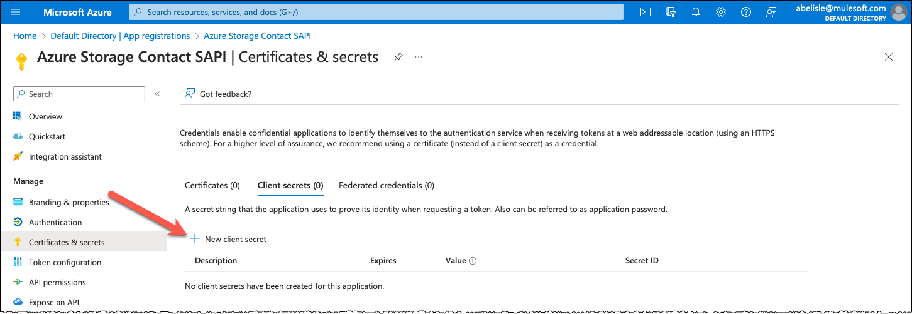
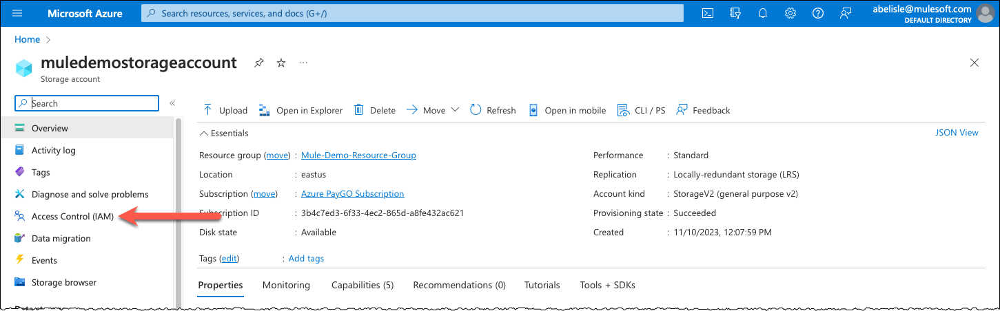
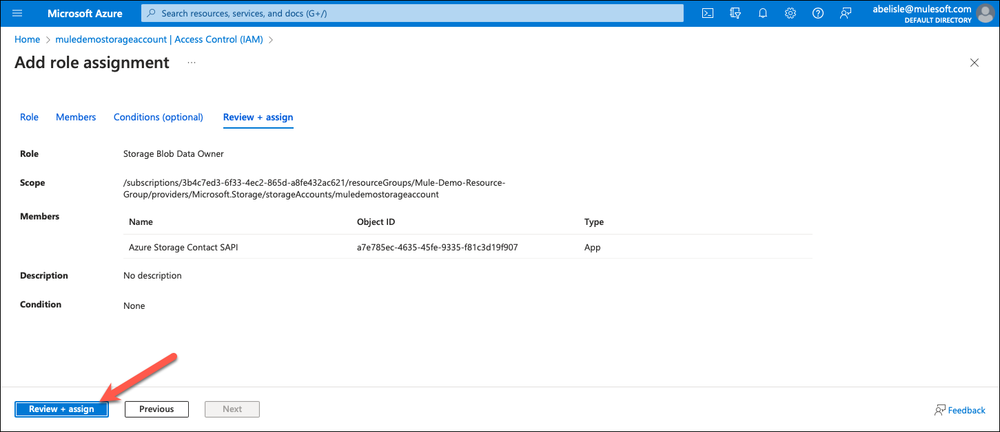
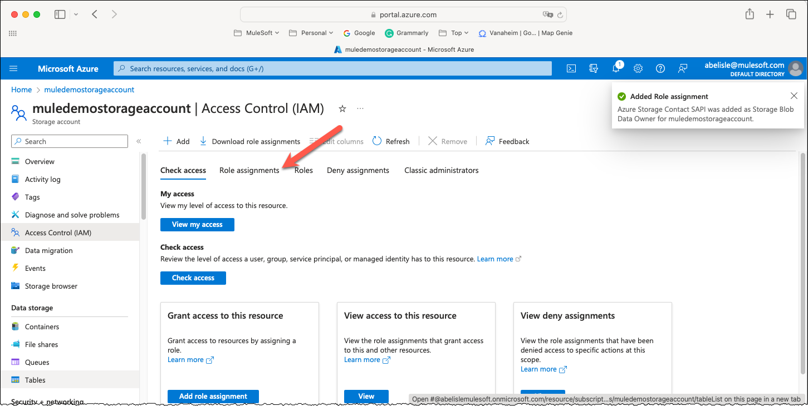

How to Integrate with Azure Storage and Azure Data Lake Storage Gen2
====================================================================

## Table of Contents

- [Introduction](#introduction)
- [Integrate with Azure Storage and ADLS Gen2](#integrate-with-azure-storage-and-adls-gen2)
  - [Part 1 – Configure Azure Resources](#part-1--configure-azure-resources)
  - [Part 2 – Review Implementation](#part-2--review-implementation)
- [Appendix](#appendix)

<p>&nbsp;</p>

# Introduction

## Overview

Earlier this year, a prospect asked us to demo how to store CSV files in Azure Blob Storage as part of a proof of concept. Recently, a customer asked us how to publish JSON data to Azure Data Lake Storage (ADLS) Gen2. I authored this guide to capture the essence of the work completed to demo how to integrate Mule with Azure Storage and Azure Data Lake Storage Gen2.

### About Azure Storage

Before we start configuring and building, it is important to understand that Microsoft's documentation uses and refers to both, Azure Storage and Azure Blob Storage, and it can get confusing at times. In short, Azure Storage is a platform of data services, including but not limited to Azure Blobs (a.k.a., Azure Blob Storage), Azure Files, Azure Queues, and Azure Tables. You can read more about this here: <https://learn.microsoft.com/en-us/azure/storage/common/storage-introduction>.

> [!IMPORTANT]
> As of this writing, although Azure Storage offers several data services, this guide only covers Azure Blob Storage.

To add to the confusion, Azure Blob Storage “includes support for big data analytics through Data Lake Storage Gen2” (1), which is “a set of capabilities dedicated to big data analytics, built on Azure Blob Storage” (2). This means that we can simply publish JSON data to Azure Storage when we want to implement big data analytics through ADLS Gen2. However, as you will read below, we need to turn on the option **Enable hierarchical namespace** in our storage account to support ADLS Gen2. When you enable this option, you can publish data to Azure Data Lake Storage Gen2 using the same Azure REST APIs as if you were storing the data in Azure Storage.

## Prerequisites

Before we start, please ensure you have an Azure account and the appropriate privileges to create resources, especially Microsoft Entra ID (formerly known as Azure Active Directory) and Azure Storage resources.

> [!NOTE]
> I authored this content using a pay-as-you-go subscription. . I cannot confirm if you can create all the required resources using a trial subscription.

# Integrate with Azure Storage and ADLS Gen2

In my experience, building the Mule application to interact with Azure resources such as Azure Storage, Azure Data Lake Storage (Gen2), and Azure Event Hubs is the easy part. The brunt of the work is configuring the different resources in Azure to enable the integration. First, I will guide you through my approach to configuring my Azure account and provisioning all the required resources. Then, I will share and describe a sample system API I built to illustrate how to integrate with Azure Storage and Azure Data Lake Storage (Gen2).

## Part 1 – Configure Azure Resources

### 1.1 – (Optional) Create a Resource Group

Although this step is optional, I recommend creating a resource group to hold all related resources – e.g., all resources created to support a specific customer demo or proof of concept.

- In the **Microsoft Azure Portal**, click **Create a resource** towards the upper left corner.

  

- On the **Create a resource** page, enter *resource group* in the **Search services and marketplace** search bar.

  

- In the search results, click the **Create** button in the **Resource group** tile.

  

- On the **Basics** tab of the **Create a resource group** page:

  - Enter the name of the resource group, and
  - Optionally, select a different Azure region.

  

  Once done, click the **Next : Tags >** button.

- On the **Tags** tab of the **Create a resource group** page, add any tags. I typically do not add any, as I leverage the resource group to hold all related resources for a project.

  

  Once done, click the **Next : Review + create >** button.

- On the **Review + create** tab of the **Create a resource group** page, verify that the validation passed and click the **Create** button.

  

  Azure creates our resource group immediately.

- On the **Marketplace** page, click **Home** in the breadcrumbs (upper left corner) to return to the Azure Portal home page.

  

### 1.2 – Configure Azure Storage

When integrating with Azure Storage, there are two essential resources:

1.  The **storage account** acts as a unique namespace for related data objects in Azure Storage. Azure Storage offers several types of storage accounts with different features and pricing models (3). For the proof of concept and demo, I used a storage account of type *Standard general-purpose v2*, which supports Blob Storage (including Data Lake Storage Gen2), Queue Storage, Table Storage, and Azure Files. You can read more about this here: <https://learn.microsoft.com/en-us/azure/storage/common/storage-account-overview>.
2.  A **storage container** “organizes a set of blobs, similar to a directory in a file system. A storage account can include an unlimited number of containers, and a container can store an unlimited number of blobs” (4).

#### 1.2.1 – Create a Storage Account

In this step, we create a storage account while selecting options that drive the costs down. Those options are typically appropriate for demoing how to integrate Mule with Azure Storage and Azure Data Lake Storage Gen2.

- In the **Microsoft Azure Portal**, click **Create a resource** towards the upper left corner.

  

- On the **Create a resource** page, enter *storage account* in the **Search services and marketplace** search bar.

  

- In the search results, click the **Create** button in the **Storage account** tile.

  

- On the **Basics** tab of the **Create a storage account** page:

  - Enter the name of the storage account,

  > [!IMPORTANT]
  > Notice the name requirements in the yellow box of the screen capture below.

  - Optionally, select a different **Azure** region,
  - Optionally, select a different **Performance** option, and
  - Optionally, select a different **Redundancy** option.

  

  > [!TIP]
  >  I selected **Locally-redundant storage** for the proof of concept and demo as it is the least expensive redundancy option.

  Once done, click the **Next : Advanced >** button.

- On the **Advanced** tab, we can use the default configuration when working with Azure Blob Storage. However, as per the screen capture below, we must turn on the **Enable hierarchical namespace** option when working with ADLS Gen2.

  > [!IMPORTANT]
  > Obviously, the **Enable hierarchical namespace** option enables ADLS Gen2 in our storage account. More importantly, it is the only difference I noticed between the proof of concept (i.e., storing data in Azure Blob Storage) and the demo (i.e., storing data in ADLS Gen2). As such, I ended up using the same approach and Mule application in both cases!

  I suggest turning on the **Enable hierarchical namespace** option for convenience as you cannot change it once the storage account is created. I used the default configuration for all other options.

  
  

  > [!TIP]
  > You can turn on the options **Enable SFTP**, **Enable network file system v3**, or both. Enabling these options enables you to leverage them to integrate with ADLS Gen2.

  Once done, click the **Next : Networking >** button.

- I used the default configuration on the **Networking** tab. However, you can optionally select a different **Network access** option to secure your storage account and its content.

  

  Click the **Next : Data protection >** button.

- On the **Data protection** tab, I turned off the soft delete options for the proof of concept and demo as all soft-deleted data is billed at the same rate as active data. I used the default configuration for all other options.

  

  Click the **Next : Encryption >** button.

- I used the default configuration on the **Encryption** tab.

  

  Click the **Next : Tags >** button.

- Optionally, add any tags on the **Tags** tab. I typically do not add any, as I leverage the resource group (created in step 1.1) to hold all related resources for a given proof of concept or demo.

  

  Click the **Next : Review >** button.

- Azure displays errors at the top of the page if validation fails (e.g., storage account name already in use). Correct any issue and click the **Create** button once done.

  

- Azure provisions our storage account, which generally takes less than a few minutes.

  

- Wait for the deployment to complete.

  

  Click **Home** in the breadcrumbs (upper left corner) to return to the Azure Portal home page.

#### 1.2.2 – Create a Storage Container

In this step, I typically create a single storage container, which is sufficient for a demo or proof of concept. Naturally, you can create as many as you need following the process described in this subsection.

- On the Azure Portal home page, click the name of your storage account in the **Recent** tab of the **Resources** section.

  

- Click **Containers** on the **Overview** page under the **Data storage** section on the left.

  

- Click **+ Container** on the **Containers** page.

  

- In the right column, enter the name of the container. Notice the naming restrictions in the following screen capture.

  

  I used default configuration for all other options.

  

  Click **Create** once done.

- Azure creates our storage container immediately.

  

- Repeat this process to create additional storage containers as needed.

Once done, click **Home** in the breadcrumbs (upper left corner) to return to the Azure Portal home page.

### 1.3 – Configure Authentication and Authorization

In this step, we configure resources to allow our Mule application to access our storage account and interact with its content (e.g., access a container, read, and write blobs).

#### About Authorizing Access to Azure Storage Overview

Before we start, it is important to understand that there are three primary options for authorizing access to Azure Storage resources (e.g., storage accounts, containers, blobs). You can read more about this here: <https://learn.microsoft.com/en-us/rest/api/storageservices/authorize-requests-to-azure-storage>.

- **Option 1 – Shared Key (storage account key):** when using this option, the client passes a header with every request that is signed using a storage account access key. Microsoft recommends that you disallow Shared Key authorization for all storage accounts as it grants access to the entire storage account and all its content.
- **Option 2 – Shared access signature (SAS):** when using this option, the client connects to a signed URL that provides limited delegated access to blobs, files, queues, and tables contained in the associated storage account.
- **Option 3 – Microsoft Entra ID (formerly known as Azure Active Directory):** when using this option, you can use Azure role-based access control (Azure RBAC) to grant permissions to a security principal, which may be a user, group, or application service principal. Microsoft Entra ID authenticates the security principal and returns an OAuth 2.0 token used subsequently to authorize requests against the Azure Storage service.

Microsoft recommends using an Entra ID security principal to authorize access to Azure Storage, when possible, for optimal security and ease of use. As such, I leveraged an Entra ID security principal in the proof of concept and demo.

#### 1.3.1 – Register an Application

When leveraging Microsoft Entra ID credentials, the first thing to do is register a client application representing our Mule application.

- In the **Microsoft Azure Portal**, click the **Microsoft Entra ID** icon.

  

- If it is not visible, click the hamburger menu in the top left corner, and select **Microsoft Entra ID**.

  

- Click **App registrations** on the **Overview** page on the left.

  

- Click **+ New registration** on the **App registrations** page.

  

- On the **Register an application page**, enter the name of the client application. I used the name of the Mule application or API for the proof of concept and demo. I also used the default configuration for all other options.

  

Click the **Register** button once done.

- Azure registers our application (generally) immediately.

  

- Finally, before proceeding to the next steps:

  - Click the copy icon beside the **Application (client) ID** value and save it for future use. As the name implies, this value represents the client id, which we will use to authenticate our Mule application.
  - Similarly, click the copy icon besides the **Directory (tenant) ID** value and save it for future use. As the name implies, this value represents the tenant id, which is also required to authenticate our Mule application.

  

**Remark:** Please do not navigate away from this page, as we will resume from here in the next step.

#### 1.3.2 – Add Permission to the Application

Next, we add permission to grant the client application access to the Azure Storage API.

- Continuing from the previous steps, click **API permissions** on the left on the **Overview** page of the newly registered application.

  

- Click **+ Add a permission** on the **API permissions** page.

  

- Click the **Azure Storage** tile on the **Microsoft APIs** tab.

  

- For the Azure Storage API permissions, enable the **user_impersonation** option and click the **Add permissions** button.

  

- Permissions for our registered application are all set.

  

**Remark:** Please do not navigate away from this page, as we will resume from here in the next step.

#### 1.3.3 – Create Client Secret for the Application

Then, we generate a client secret for our application, which is required for authentication.

- Continuing from the previous steps, click **Certificates & secrets** on the left of the **Overview** page of the newly registered application.

  

- On the **Client secrets** tab, click **+ New client secret**.

  

- In the right column, enter a general description and optionally change the expiration.

  

  Click the **Add** button once done.

- Azure generates a new client secret. As indicated in the screen capture below, we can only view the Value after its creation. **Click the copy icon and save the client secret value safely for future use.**

  

> [!IMPORTANT]
> The Secret ID is a unique identifier and does not represent the client id. More importantly, we do not need the secret id.

Click **Home** in the breadcrumbs (upper left corner) to return to the Azure Portal home page.

#### 1.3.4 – Assign Role to Application on Storage Account

Finally, we assign a role to our application, allowing it to access our Azure storage account and perform operations on its contents.

- On the **Azure Portal** home page, click the name of your storage account in the **Recent** tab of the **Resources** section.

  

- Click **Access Control (IAM)** on the left.

  

- Click **+ Add** and select **Add role assignment**.

  

- Optionally, enter *storage* in the search bar on the **Role** tab and select the role **Storage Blob Data Owner**.

  > [!NOTE]
  > I use the role **Storage Blob Data Owner** for convenience as it grants full access to Azure Blob Storage in my storage account. Naturally, I could select another role with less privileges and I could also add more role assignments to grant additional access and privileges to other services for example.

  

  Click the **Next** button once done.

- On the **Members** tab, select the option **User, group, or service principal**, and click **+ Select members**.

  - In the right column:
    - Type the name of your client application (e.g., *Azure Storage Contact SAPI*) in the search box.
    - Select your client application.

  

- Once you have selected your client application, click the **Select** button.

  

- Next, click the **Review + assign** button.

  

- On the **Review + assign** tab, click the **Review + assign** button again.

  

- Azure adds the role assignment immediately. Optionally, click the **Role assignments** tab to review all assignments.

  

- We completed assigning our registered application a role on our storage account and its contents, which concludes configuring the required Azure Resources, including authentication and authorization.

  

Click **Home** in the breadcrumbs (upper left corner) to return to the Azure Portal home page.

## Part 2 – Review Implementation

As discussed in the Introduction section, I built the Mule application to discuss and demo how to integrate with Azure Storage and Azure Data Lake Storage Gen2. In short, there are two different API sets we need to call to integrate with Azure Storage and Azure Data Lake Storage Gen2:

- First, we leverage the Microsoft Entra ID API to authenticate and get an (OAuth 2.0) access token.
- Then, we use the access token to call the Azure Storage API to interact with our storage accounts and its contents.

> [!TIP]
> When I need to implement a new integration involving APIs and technologies I am not familiar with, I typically start with Postman (or even curl) and use a trial-and-error approach. Using Postman allows me to fine-tune everything more quickly. You can make changes and call APIs in seconds using Postman, whereas you need to rebuild the Mule application before you can test your changes, even if they are minor.

### 2.1 – (Optional) Test Azure Configuration Using Postman

Although this step is optional, I recommend testing the Azure configuration we just completed using Postman before implementing the Mule application. I published my basic Postman collection to GitHub, which I used to learn and test how to use the Azure APIs to integrate with Azure Storage and Azure Data Lake Storage Gen2. You can find it here: <https://github.com/abelisle-mulesoft/azure-storage-sapi-example/tree/main/postman-collection>.

#### 2.1.1 – Update Variables

- In Postman, click the **Azure Storage** collection on the left, and click the **Variables** tab.

  

- Update the values of the variables **storage-account**, **tenant-id**, **client-id**, and **client-secret** with your own values.

  

#### 2.1.2 – Test Authentication

First, we review the first API request, which we use to authenticate and get an (OAuth 2.0) access token from Microsoft Entra ID. Then, we execute it to test our configuration – e.g., registered client application, client secret.

- In Postman, expand the **Authentication** folder, click the **Get Access Token** request, and click the **Headers** tab.

  

- Review the screen capture below.

  

  - First, I want to point that I use a Post method. In short, the older version of this API uses a Post whereas the most recent uses a Get (with some other changes).
  - Second, review the URI and notice the *{{tenantId}}* variable. Obviously, we are executing this request and authenticating using our tenant id.
  - Finally, review the headers and note that Postman auto-generated all of them. More importantly, I did not add any additional ones.

- Click the **Body** tab and review the screen capture below.

  

- Per the screen capture, the mime type is `application/x-www-form-urlencoded`, and the body contains four key-value pairs:

- **client_id**, which represents the client application we registered in step 1.3.1. We also copied its value in step 1.3.1.
- **client_secret**, which represents the client secret we created in step 1.3.2. Similarly, we copied its value in step 1.3.2.
- **resource**, which specifies the Azure resource we want to access.
- **grant_type**, which is set to **client_credentials** since we are using a service principal and not a user.

- Once done reviewing, execute this request by clicking the **Send** button.

  

- Microsoft Entra ID returns an HTTP status of 200 and an access token if our Azure and Postman configurations are valid. More importantly, this request's URI, headers, and body guide the configuration of the associated HTTP request in our Mule application.

  

  > [!NOTE]
  > The value of the **expires_in** property is in seconds. Hence, the access token we just received is valid for an hour.

  Copy the value of the *access_token* from the response you just got.

- Click the **Azure Storage** tab and paste the **access_token** value into the **accessToken** variable.


Postman is all set to start interacting with Azure Storage, at least until our access token expires.

#### 2.1.3 – Test Creating a Block Blob

Next, we leverage the access token we pasted in the relevant variable, and we are ready to call the Azure Storage API to interact with our storage account and storage container. I created three basic API requests to experiment interacting with Azure Storage – i.e., create a block blob, get a blob, and list all blobs within a container.

First, we review the request to create a block blob and its configuration and then execute it to test our Azure Storage configuration.

- Expand the **Blob Storage** folder, click the **Create Block Blob** request, and review its URI.

  

  - First, I want to point that the Azure API exposes a Put method (instead of a Post) as it supports creating a new blob or updating its content if it already exists.
  - Second, review the URI and notice the *{{storage-account}}* variable. Obviously, we are executing this request against our storage account.
  - Also notice that I hardcoded two URI parameters. Naturally, I could use variables in Postman. Regardless:

    - **contact-data/** represents the name of the storage container I created in step 1.2.2. I could as well specify something like **contact-data/salesforce/2023/**, for example. In other words, in my example, I am specifying two subdirectories (**salesforce/2023**), which Azure Storage will create within the storage container if they do not exist.
    - **blob01.json** represents the name of the blob to create.

- Now, click the **Headers** tab and review the headers.

  

  - In the screen capture, the headers in the green box are default ones generated by Postman for this specific request.
  - The headers in the red box are ones that I had to specify as per Azure’s documentation, which you can read here: <https://learn.microsoft.com/en-us/rest/api/storageservices/put-blob>.
    - **Authorization** (obviously) represents our (bearer) access token.
    - **x-ms-version** represents the API version, which, sadly, is not trivial to uncover in Azure’s documentation. I do not recall where I grabbed this specific version.
    - **x-ms-blob-type** represents the type of blob to create – i.e., append, block, or page. You can read more about the blob types here: <https://learn.microsoft.com/en-us/rest/api/storageservices/understanding-block-blobs--append-blobs--and-page-blobs>.

  > [!NOTE]
  > As of this writing, this guide, my Postman collection, and sample Mule project only cover Block Blobs. More to the point, Azure documentation includes section dedicated to each type of blob as creating append and page blobs require additional steps.
  > 1)  Append blobs: <https://learn.microsoft.com/en-us/rest/api/storageservices/operations-on-append-blobs>
  > 2)  Block blobs: <https://learn.microsoft.com/en-us/rest/api/storageservices/operations-on-block-blobs>
  > 3)  Page blobs: <https://learn.microsoft.com/en-us/rest/api/storageservices/operations-on-page-blobs>

- Next, click the **Body** tab, and as you see, I pasted some simple JSON object, which is what will be stored in the block blob.

  

- Finally, click the **Send** button.

  

  Azure Storage returns an HTTP status of 201 (and no response body) if our Azure and Postman configurations are valid. More importantly, the request's URI parameters, query parameter, headers, and body guide the configuration of the associated HTTP request in our Mule application.

  > [!NOTE]
  > You can update the body and execute the request again. Azure will replace the content of the blob with the new body – i.e., it does not append the content. It will still return a simple HTTP 201 status without a body – i.e., without any indication that it updated the blob instead of creating it.

#### 2.1.4 – (Optional) Test Listing Blobs

I added the List Blobs request in Postman to support testing creating blobs without logging into my Azure account every time. However, I did not implement this functionality in my Mule application.

- Optionally, click on the **List Blobs** request and execute it.

  

  As per the screen capture, this request lists the content of the **contact-data** storage container (as specified by the URI parameter).

#### 2.1.5 – (Optional) Test Getting a Blob

- Optionally, click on the **Get Blob** request and execute it.

  

  As per the screen capture and implied in the request’s name, this request gets the content of **blob blob01.json** within the **contact-data** storage container (as specified by the implied URI parameters).

## Part 3 – Review Implementation

In this section, I assume you cloned my Anypoint Studio project from GitHub and imported it. As such, I intentionally do not include XML snippets as I described the implementation.

> [!NOTE]
> I implemented only the critical components in my Studio project while keeping it as simple as possible. In short, you call the Post method of the `block-blobs` resource, and it creates (or updates) a block blob in Azure Storage and sets it’s content to the object you include in the request body. It is as simple as that.

> [!IMPORTANT]
> I increased log verbosity to Trace in my Studio project for convenience. You might want to update the file `src/main/resources/log4j2.xml` if you plan to leverage my project for your own implementation.

- First, I created this project by importing a simplistic API specification to benefit from the scaffolding. You can find the API specification within the project.

  

- Naturally, I leverage a properties file in YAML format, but I named it to support having an environment specific file – e.g., **mule-props-\<environment\>**.

  

> [!IMPORTANT]
> As per infosec best practices, I did not commit my development properties file to GitHub as it contains sensitive information. However, I provided a template to enable you to create one specific to your own implementation and Azure resources.

- I leveraged three Mule configuration files as per MuleSoft best practices.

  

- In the **global.xml** file, first, notice the global property that specifies the current environment as per best practices.

  

  > [!TIP]
  > If you are not familiar with this practice, we typically override this property when deploying our application to higher environments (e.g., test, QA, prod), which results in picking up the properties file specific to that environment.

- Then, notice I configured my **Configuration properties** element accordingly.

  

- In the **azure-storage-sapi.xml** file, notice the error handlers. First, I renamed the `Transform Message` components as I prefer meaningful names.

  

- Then, I added a catch all error handler, which is a practice I learned while working on a project reviewed by the Global SE Team.

  

- Finally, I use a (more) comprehensive response body in all my APIs. The JSON “structure” you see here is influenced by API specifications and fragments published in Anypoint Exchange – e.g. accelerators.

  

  > [!NOTE]
  > Refer to section [Error Payload Example](#error-payload-example) in the appendix for more information about my default error body.

- The **azure-storage-sapi-impl.xml** file includes two flows. The first, as its name implies, implements the logic to get an access token from Microsoft Entra ID.

  

  Notice the **On Error Propagate** and **Logger** components (refer to the screen capture of the flow above). I added them to log the entire payload Microsoft Entra ID returns when throwing an error to help troubleshoot issues. It is often (but not always) helpful.

- This flow creates the request body, which is very similar to the one we reviewed in section **2.1.2 – Test Authentication**. Naturally, I leverage properties where practical.

  

- Then, it calls the Microsoft Entra ID API to get an access token. As implied in the following screen capture, its configuration is inherited from the associated HTTP Request Configuration global element. As reviewed in step 4, this API does not expect any specific header and query parameter. I arbitrarily included the URI parameter in the base path in the associated HTTP Request Configuration global element.

  

- The second flow, as it’s name implies, implements the logic to create (or update) a block blob in Azure Storage.

  

- The logic is relatively self-intuitive (I assume I did a good job with the component names) but I need to highlight one difference in implementing the `Request` component compared to its Postman equivalent. More specifically, in the `Headers`, I learned the hard way that you must include the `Content-Length`; it is auto-generated in Postman and we do not need to worry about it. If you do not include it, the Azure storage API throws a bad request (HTTP status 400) with an error type of *UnsupportedHeader* and the following error message “*One of the HTTP headers specified in the request isn't supported*” (5). I spent a lot of time troubleshooting this issue in the proof of concept as the error type and error message are misleading.

  


# Appendix

## Comprehensive Response

As stated and illustrated in section **Part 3 – Review Implementation**, I use a (more) comprehensive response body in all my APIs. Following is an example of the payload returned when an error occurs.

```json
{
  "dateTime": "2023-01-01T08:00:00.000-08:00",
  "httpStatus": "500",
  "errorMessage": "Operation failed (see responseDetails for more information)",
  "errorType": "VALIDATION_FAILED",
  "responseStatus": "ERROR",
  "responseDetails": [
    {
      "severity": "ERROR",
      "code": "EFBIG",
      "message": "An abnormal condition occurred"
    }
  ]
}
```

Following is more information about the properties.

| **Property**     | **Required?** | **Description**                                                                                                                                                                                                                              |
|------------------|---------------|----------------------------------------------------------------------------------------------------------------------------------------------------------------------------------------------------------------------------------------------|
| dateTime:        | Y             | Date and time we are reporting the error (i.e., Dataweave function `now()`).                                                                                                                                                                   |
| httpStatus:      | Y             | HTTP status code of the response.                                                                                                                                                                                                            |
| errorMessage:    | Y             | Summary message.                                                                                                                                                                                                                             |
| errorType:       | Y             | Error type.                                                                                                                                                                                                                                  |
| responseStatus:  | N             | Optional property that indicates the overall status of the operation (e.g., SUCCESS, WARNING, ERROR).                                                                                                                                        |
| responseDetails: | N             | Optional array, which is a structure for providing additional details to a response returned by an API.                                                                                                                                      |
|   severity:        | N             | Indicates the severity of this responseDetails.message (i.e., INFO, WARNING, ERROR).                                                                                                                                                         |
|   code:            | N             | Represents an optional alphanumeric code that uniquely identifies this message. We included this property to support cataloging messages and provide additional information such as comprehensive descriptions, mitigation, workaround, etc. |
|   message:         | N             | Represents the short text or description of this `responseDetails.message`.

## References

- 1 - <https://learn.microsoft.com/en-us/azure/storage/common/storage-introduction>
- 2 - <https://learn.microsoft.com/en-us/azure/storage/blobs/data-lake-storage-introduction>
- 3 - <https://learn.microsoft.com/en-us/azure/storage/common/storage-account-overview>
- 4 - <https://learn.microsoft.com/en-us/azure/storage/blobs/storage-blobs-introduction>
- 5 - <https://learn.microsoft.com/en-us/rest/api/storageservices/common-rest-api-error-codes>
